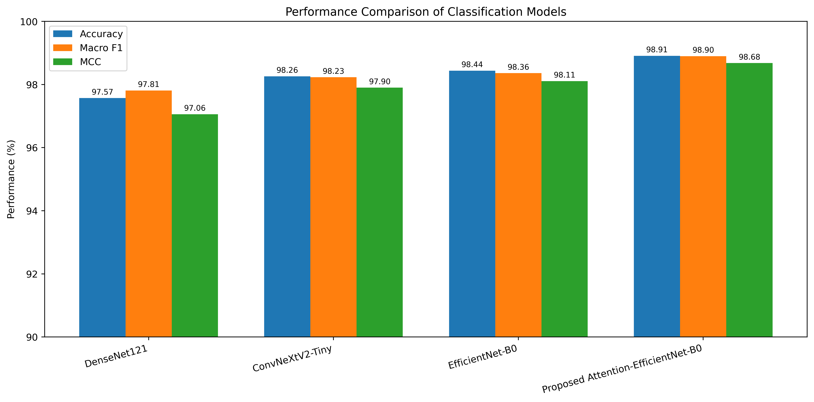
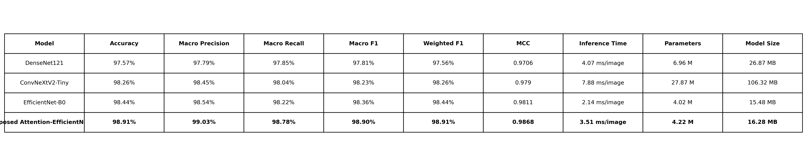

# Nail Condition Classification Using Deep Learning

An artificial intelligence-based nail condition classification system developed using deep learning and computer vision techniques. The project evaluates multiple convolutional neural network architectures for classification of six nail-related conditions and provides explainable predictions using Grad-CAM.

---

## Project Overview

This project investigates deep learning models for automated classification of nail conditions from images.

Four models are evaluated:

- DenseNet121
- ConvNeXtV2-Tiny
- EfficientNet-B0
- Proposed Attention-EfficientNet-B0

The system provides:

- Nail image classification
- Prediction confidence
- Class probability distribution
- Grad-CAM visual explanations
- Interactive web-based interface using Streamlit

---

## Supported Classes

The classification system supports six classes:

1. Acral Lentiginous Melanoma
2. Healthy Nail
3. Onychogryphosis
4. Blue Finger
5. Clubbing
6. Pitting

---

## Final Experimental Results

The four models were evaluated using the reported classification and computational metrics.

| Model | Accuracy | Macro Precision | Macro Recall | Macro F1 | Weighted F1 | MCC | Inference Time | Parameters | Model Size |
|---|---:|---:|---:|---:|---:|---:|---:|---:|---:|
| DenseNet121 | 97.57% | 97.79% | 97.85% | 97.81% | 97.56% | 0.9706 | 4.07 ms/image | 6.96 M | 26.87 MB |
| ConvNeXtV2-Tiny | 98.26% | 98.45% | 98.04% | 98.23% | 98.26% | 0.9790 | 7.88 ms/image | 27.87 M | 106.32 MB |
| EfficientNet-B0 | 98.44% | 98.54% | 98.22% | 98.36% | 98.44% | 0.9811 | 2.14 ms/image | 4.02 M | 15.48 MB |
| **Proposed Attention-EfficientNet-B0** | **98.91%** | **99.03%** | **98.78%** | **98.90%** | **98.91%** | **0.9868** | **3.51 ms/image** | **4.22 M** | **16.28 MB** |

The proposed Attention-EfficientNet-B0 achieves the highest reported values for accuracy, macro precision, macro recall, macro F1, weighted F1, and MCC among the four evaluated models.

### Proposed Model Results

- **Accuracy:** 98.91%
- **Macro Precision:** 99.03%
- **Macro Recall:** 98.78%
- **Macro F1:** 98.90%
- **Weighted F1:** 98.91%
- **MCC:** 0.9868
- **Inference Time:** 3.51 ms/image
- **Parameters:** 4.22 million
- **Model Size:** 16.28 MB

Although EfficientNet-B0 has lower inference time and slightly fewer parameters, the proposed Attention-EfficientNet-B0 provides the strongest reported classification performance.

---

## Performance Comparison



---

## Final Results Table



---

## Explainable AI Using Grad-CAM

The system integrates Gradient-weighted Class Activation Mapping (Grad-CAM) to visualize image regions contributing to model predictions.

Grad-CAM analysis is used to examine:

- Regions influencing model predictions
- Attention patterns
- Potential reliance on contextual image features
- High-confidence misclassifications

The visual explanations provide an additional interpretation of the model's prediction behavior.

---

## Model Architectures

### DenseNet121

DenseNet121 is used as a convolutional neural network baseline for comparison with the proposed architecture.

### ConvNeXtV2-Tiny

ConvNeXtV2-Tiny provides a modern convolutional architecture baseline with a larger parameter count and computational footprint.

### EfficientNet-B0

EfficientNet-B0 serves as a lightweight and computationally efficient baseline architecture.

### Proposed Attention-EfficientNet-B0

The proposed model extends EfficientNet-B0 with an attention mechanism intended to improve the model's ability to focus on informative image features relevant to nail-condition classification.

The proposed model contains approximately **4.22 million parameters** and has a reported model size of **16.28 MB**.

---

## Project Structure

```text
Nail-Condition-Classification/
|
├── data/
│   └── grouped_split/
|
├── results/
│   ├── figures/
│   ├── metrics/
│   ├── models/
│   └── paper_results/
│       ├── figures/
│       ├── reports/
│       └── tables/
|
├── src/
│   ├── train_efficientnet_b0.py
│   ├── train_densenet121.py
│   ├── train_convnextv2.py
│   ├── train_proposed_model.py
│   ├── train_attention_efficientnet_b0.py
│   ├── evaluate_efficientnet_b0.py
│   ├── evaluate_densenet121.py
│   ├── evaluate_convnextv2.py
│   ├── evaluate_proposed_model.py
│   └── evaluate_models_on_unseen_source_test.py
|
├── requirements.txt
├── .gitignore
└── README.md
Final Results Files

The publication-oriented final comparison files are available under results/paper_results/.

Final Comparison Table

results/paper_results/tables/final_model_comparison.csv

Final Comparison Table Image

results/paper_results/figures/final_model_comparison_table.png

Performance Comparison Figure

results/paper_results/figures/model_performance_comparison.png

Final Results Report

results/paper_results/reports/final_results_table.md

Results and Metrics

The repository contains the generated evaluation metrics and visualizations for the evaluated architectures.

Important result directories include:

results/
├── figures/
├── metrics/
├── models/
└── paper_results/

The results/figures/ directory contains model comparison plots, confusion matrices, ROC curves, training curves, inference-time comparisons, and other generated visualizations.

The results/metrics/ directory contains the reported numerical evaluation results and per-class comparison metrics.

Reproducibility

The training and evaluation scripts used for the experiments are included in the src/ directory.

The final comparison tables and publication-oriented figures are available under:

results/paper_results/

The main training scripts include:

train_efficientnet_b0.py
train_densenet121.py
train_convnextv2.py
train_proposed_model.py
train_attention_efficientnet_b0.py

Evaluation scripts include:

evaluate_efficientnet_b0.py
evaluate_densenet121.py
evaluate_convnextv2.py
evaluate_proposed_model.py
evaluate_models_on_unseen_source_test.py
Technologies Used

The project is implemented using Python-based deep learning and computer vision technologies.

Key technologies include:

Python
PyTorch
Torchvision
OpenCV
NumPy
Pandas
Scikit-learn
Matplotlib
Grad-CAM
Streamlit
Key Findings

The final comparison shows that the proposed Attention-EfficientNet-B0 achieves the highest reported classification performance among the evaluated models.

The proposed model achieves:

98.91% Accuracy
99.03% Macro Precision
98.78% Macro Recall
98.90% Macro F1
98.91% Weighted F1
0.9868 MCC

The model contains 4.22 million parameters and has a reported size of 16.28 MB.

Compared with the larger ConvNeXtV2-Tiny architecture, the proposed model uses substantially fewer parameters and has a smaller reported model size while achieving higher classification performance.

Compared with EfficientNet-B0, the proposed attention-enhanced architecture provides higher reported accuracy, macro precision, macro recall, macro F1, weighted F1, and MCC, with a modest increase in inference time and model size.

Conclusion

This project demonstrates the application of deep learning and computer vision for automated nail-condition classification.

The evaluated architectures provide strong classification performance, while the proposed Attention-EfficientNet-B0 achieves the strongest reported results in the final model comparison.

The combination of classification, confidence estimation, Grad-CAM visualization, and an interactive Streamlit interface provides a complete experimental framework for image-based nail-condition analysis.

Disclaimer

This project is intended for research and educational purposes only. The predictions generated by the system should not be considered a medical diagnosis or a substitute for professional medical evaluation.

License

This project is intended for academic and research use.
